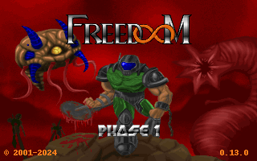

# Doom in a cloud session

Can Doom run inside a Claude Code cloud session? It's just a Linux container,
so yes:



That GIF was rendered inside the container, which has no display, no GPU and
no sound card. [doomgeneric](https://github.com/ozkl/doomgeneric) runs the
game with a small custom backend, and [Freedoom](https://freedoom.github.io/)
(a free replacement for the original game data) supplies the levels.

## Quick start

Needs `gcc`, `make`, `git`, and Python 3 with Pillow (`pip install pillow`).

```sh
python3 doom.py build   # fetch doomgeneric + Freedoom and compile (~10 s)
python3 doom.py play "hold forward 3s; turn left 6; hold fire 2s" --gif out/run.gif
```

`play` prints the player's state as JSON and writes the last frame to
`out/last.png`:

```json
{"tic": 181, "state": "level", "episode": 1, "map": 1, "health": 100, "armor": 0,
 "weapon": "pistol", "ammo": 45, "kills": 1, "total_kills": 29, "items": 0,
 "secrets": 0, "dead": false, "x": 466, "y": 256, "angle": 5}
```

To re-render the demo above:
`python3 doom.py play --title -f examples/demo.txt --gif media/demo.gif`.

## How it works

doomgeneric reduces a Doom port to six platform functions. `src/doomgeneric_headless.c`
implements them without a screen or a real clock:

- **Virtual clock.** "Sleeping" advances a counter instead of waiting, so the
  game runs as fast as the CPU allows: about 40× real time on one core
  (2 minutes of game in about 3 seconds).
- **Deterministic.** Doom's randomness comes from a fixed table, so the same
  moves always produce the same game, down to the pixel.
- **Exact input timing.** The game runs in singletics mode (the mode Doom
  uses for `-timedemo`): each frame builds input for exactly one tic (1/35 s)
  and runs it. Scripted key events are posted straight into Doom's event
  queue on the tic they're due.
- **Output.** Frames are written as PPM images, and when the run ends the
  final frame and a JSON status line are written out.

`doom.py` compiles the move language below into key events, runs the binary,
and turns the frames into a GIF (lossless, since Doom only uses 256 colours)
and a PNG.

## Move language

Moves are separated by `;` or newlines, and `#` starts a comment.

| Move | What it does |
| --- | --- |
| `hold KEYS TIME` | hold keys down, e.g. `hold forward 2s`, `hold forward+fire 1s` |
| `tap KEYS [xN]` | a quick press, e.g. `tap use`, `tap down x2` |
| `turn left\|right DEGREES` | turn in place, accurate to about 2° |
| `wait TIME` | do nothing |
| `press KEYS` / `release KEYS` | for overlapping moves: `press forward; turn left 90; release forward` |

`TIME` is `2s`, `500ms` or `10t` (tics, 35 per second). A bare number means
seconds.

Keys: `forward`, `back`, `left`, `right`, `strafeleft`, `straferight`,
`fire`, `use`, `run`, `enter`, `esc`, `tab` (automap), `pause`, `f1`–`f12`,
and any single letter or digit (`1`–`7` switch weapons).

`tap fire` fires once. A tap during the firing animation is ignored, as in
the real game, so use `hold fire 2s` to keep shooting.

## Turn-based play

`--session NAME` saves your moves under `build/sessions/`. Each call replays
the earlier moves (fast, and identical every time), adds the new ones, and
writes a GIF of only the new part. That means you can play Doom through chat
one turn at a time:

```sh
python3 doom.py play --session e1m1 --reset "hold forward 3s" --gif out/turn.gif
python3 doom.py play --session e1m1 "turn left 6; hold fire 2s" --gif out/turn.gif
python3 doom.py play --session e1m1 "hold forward 1.5s" --gif out/turn.gif
```

## Options

| Option | Default | |
| --- | --- | --- |
| `--wad` | `freedoom1` | `freedoom1`, `freedoom2`, or a path to any IWAD, e.g. the shareware `doom1.wad` |
| `--level` | `E1M1` / `MAP01` | level to start on |
| `--skill` | `3` | 1 (easiest) to 5 (nightmare) |
| `--title` | | start at the title screen instead of warping to a level |
| `--gif` | | write an animated GIF of the run |
| `--every` | `2` | GIF frame interval in tics (2 = 17.5 fps) |
| `--scale` | `1` | GIF scale factor (frames are 320×200) |
| `--shot` | `out/last.png` | PNG of the final frame, 640×400 |
| `-f FILE` | | read moves from a file |

## Credits

- [doomgeneric](https://github.com/ozkl/doomgeneric) by ozkl, based on Chocolate
  Doom and id Software's Doom source. It is GPL-2.0, so binaries built here are
  too. `doom.py build` downloads it at a pinned commit; this repo doesn't include it.
- [Freedoom](https://freedoom.github.io/) 0.13.0, BSD-style licence, downloaded
  from its GitHub release and checked against a SHA-256 hash.
