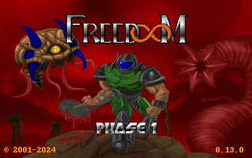

# Doom in a cloud session

Can Doom run inside a Claude Code cloud session? It's just a Linux container,
so yes:



That GIF was rendered inside the container, which has no display, no GPU and
no sound card. [doomgeneric](https://github.com/ozkl/doomgeneric) runs the
game with a small custom backend, and [Freedoom](https://freedoom.github.io/)
(a free replacement for the original game data) supplies the levels. An
[autopilot](#autopilot), also written in the session, then played through all
of Episode 1, from the title screen to the ending text.

## The container

This is what the Claude Code cloud session looked like when this was built
(September 2026). Other sessions may get different hardware.

| | |
| --- | --- |
| CPU | 4 vCPUs, Intel Xeon @ 2.80 GHz, in a KVM virtual machine |
| Memory | 15 GiB, no swap |
| Disk | `df` shows 30 GB free, but writable space is a per-session allowance, so it can be less |
| GPU, display, sound | none: no `/dev/dri`, no `$DISPLAY`, no `/dev/snd` |
| OS | Ubuntu 24.04.4 LTS, Linux 6.18 |
| Tools | gcc 13.3, make, git, Python 3.11 |
| Network | outbound HTTPS through a proxy; GitHub and Ubuntu's package mirror were reachable |
| Lifetime | reclaimed after a period of inactivity; anything not pushed to GitHub can be lost |

Doom only uses one core. With the virtual clock described below, 2 minutes of
game time takes about 3 seconds.

## Quick start

Needs `gcc`, `make`, `git`, and Python 3 with Pillow (`pip install pillow`).
For `--video`, also `pip install imageio-ffmpeg`.

```sh
python3 doom.py build   # fetch doomgeneric + Freedoom and compile (~10 s)
python3 doom.py play "hold forward 3s; turn left 6; hold fire 2s" --gif out/run.gif
```

`play` prints the player's state as JSON and writes the last frame to
`out/last.png`:

```json
{"tic": 181, "state": "level", "episode": 1, "map": 1, "health": 100, "armor": 0,
 "weapon": "pistol", "ammo": 45, "kills": 1, "total_kills": 29, "items": 0,
 "secrets": 0, "dead": false, "x": 466, "y": 256, "angle": 5.3,
 "keys": [], "weapons": ["fist", "pistol"],
 "ammo_all": {"bullets": 45, "shells": 0, "rockets": 0, "cells": 0},
 "monsters_in_sight": []}
```

`monsters_in_sight` lists every living monster the player has a clear line
to, facing or not, with its type, position and health. `keys`, `weapons` and
`ammo_all` are what the status bar shows.

To re-render the demo above:
`python3 doom.py play --title -f examples/demo.txt --gif media/demo.gif`.

`examples/e1m1-complete.txt` plays all of E1M1 from the title screen to the
exit switch (34% kills, finished in 0:44). [Watch it](media/e1m1-complete.mp4),
or re-render it with
`python3 doom.py play --title -f examples/e1m1-complete.txt --smooth --video media/e1m1-complete.mp4`.

`examples/e1m2-complete.txt` carries straight on through E1M2, starting from
the 8% health E1M1 ended on, and kills all 93 monsters on the way to the exit.
It gathers all three keycards and finishes on 102% health, with 78% of items
and 42% of secrets, in 7:21 (par is 1:15):
`python3 doom.py play --title -f examples/e1m1-complete.txt -f examples/e1m2-complete.txt`.

The rest of the episode follows the same way, each level starting with
whatever health and ammo the one before it ended on, up to the closing text
after E1M8. [Watch the last level and the ending](media/e1m8-complete.mp4).

| Level | Moves file | Kills | Health at the exit | Time |
|---|---|---|---|---|
| E1M1 | `examples/e1m1-complete.txt` | 10 of 29 | 8% | 0:44 |
| E1M2 | `examples/e1m2-complete.txt` | 93 of 93 | 102% | 7:21 |
| E1M3 | `examples/e1m3-complete.txt` | 80 of 97 | 100% | 10:24 |
| E1M4 | `examples/e1m4-complete.txt` | 115 of 124 | 105% | 6:56 |
| E1M5 | `examples/e1m5-complete.txt` | 104 of 119 | 69% | 7:19 |
| E1M6 | `examples/e1m6-complete.txt` | 188 of 192 | 15% | 12:35 |
| E1M7 | `examples/e1m7-complete.txt` | 115 of 203 | 32% | 10:48 |
| E1M8 | `examples/e1m8-complete.txt` | 3 of 3 | 39% | 1:36 |

The whole episode, about an hour of play, replays in a couple of seconds:

```sh
python3 doom.py play --title $(for i in 1 2 3 4 5 6 7 8; do echo -f examples/e1m$i-complete.txt; done)
```

To watch one level on its own, put the ones before it in a session first:

```sh
python3 doom.py play --session ep1 --reset --title $(for i in 1 2 3 4 5 6 7; do echo -f examples/e1m$i-complete.txt; done)
python3 doom.py play --session ep1 -f examples/e1m8-complete.txt --smooth --video media/e1m8-complete.mp4
```

The [autopilot](#autopilot) recorded them all.

## How it works

doomgeneric reduces a Doom port to six platform functions. `src/doomgeneric_headless.c`
implements them without a screen or a real clock:

- **Virtual clock.** "Sleeping" advances a counter instead of waiting, so the
  game runs as fast as the CPU allows: about 40× real time on one core
  (2 minutes of game in about 3 seconds).
- **Deterministic.** Doom's randomness comes from a fixed table, so the same
  moves always produce the same game, down to the pixel.
- **Exact input timing.** The game runs in singletics mode (the mode Doom
  uses for `-timedemo`): each frame builds input for exactly one tic (1/35 s)
  and runs it. Scripted key events are posted straight into Doom's event
  queue on the tic they're due.
- **Output.** Frames go out through a pipe, which Doom waits on, so even a
  long run never piles up on disk. When the run ends, the final frame and a
  JSON status line are written out.
- **Smooth camera (optional).** The autopilot turns with instant mouse flicks,
  which look jumpy on video. With `--smooth`, each frame is drawn from a camera
  that eases toward the player's real angle like a damped spring, settling in
  about a quarter of a second. The backend does this by standing in for Doom's
  `R_RenderPlayerView` at link time. The game still uses the real angle, so a
  run plays out exactly the same; only the picture changes.

`doom.py` compiles the move language below into key events, runs the binary,
and turns the frames into a GIF (lossless, since Doom only uses 256 colours),
an MP4, and a PNG of the last frame.

## Move language

Moves are separated by `;` or newlines, and `#` starts a comment.

| Move | What it does |
| --- | --- |
| `hold KEYS TIME` | hold keys down, e.g. `hold forward 2s`, `hold forward+fire 1s` |
| `tap KEYS [xN]` | a quick press, e.g. `tap use`, `tap down x2` |
| `turn left\|right DEGREES` | turn in place with the arrow keys, accurate to about 2° |
| `aim left\|right DEGREES` | turn instantly with a mouse flick, exact to 0.05° (up to 179.9°) |
| `wait TIME` | do nothing |
| `press KEYS` / `release KEYS` | for overlapping moves: `press forward; turn left 90; release forward` |

`TIME` is `2s`, `500ms` or `10t` (tics, 35 per second). A bare number means
seconds.

Keys: `forward`, `back`, `left`, `right`, `strafeleft`, `straferight`,
`fire`, `use`, `run`, `enter`, `esc`, `tab` (automap), `pause`, `f1`–`f12`,
and any single letter or digit (`1`–`7` switch weapons).

`tap fire` fires once. A tap during the firing animation is ignored, as in
the real game, so use `hold fire 2s` to keep shooting.

## Turn-based play

`--session NAME` saves your moves under `build/sessions/`. Each call replays
the earlier moves (fast, and identical every time), adds the new ones, and
writes a GIF or video of only the new part. A session keeps the `--wad`, `--level`,
`--skill` and `--title` it started with. That means you can play Doom through
chat one turn at a time:

```sh
python3 doom.py play --session e1m1 --reset "hold forward 3s" --gif out/turn.gif
python3 doom.py play --session e1m1 "turn left 6; hold fire 2s" --gif out/turn.gif
python3 doom.py play --session e1m1 "hold forward 1.5s" --gif out/turn.gif
```

## Live mode

For scripts that react to the game, the binary can stay running and take
commands on stdin. Start it with `-interactive`, and it prints the status JSON
at `-maxtics` and then waits:

```
key GAMETIC PRESSED KEYCODE   queue a key event (PRESSED: 0 up, 1 down, 2 mouse turn)
until GAMETIC                 run to that tic, then print the status again
shot FILE                     write the current frame as a PPM
sectors                       print every sector's current floor and ceiling height
items                         print the pickups still in the level
quit                          exit
```

Events must be queued in tic order, no earlier than the current tic.
`doom.compile_moves(text, tic=...)` turns move text into these events. A run
driven this way replays identically from its moves, so it can be saved as a
session or a moves file.

## Autopilot

`autopilot/` plays levels by itself through live mode and writes each run out
as a moves file. There is a script per level, since each one follows a route
written for that level; the parts in between are general:

```sh
python3 autopilot/e1m1.py   # ~10 s, writes out/e1m1-autopilot.txt
python3 autopilot/e1m2.py   # ~2.5 min, carries on from examples/e1m1-complete.txt
python3 autopilot/e1m7.py   # carries on from examples/e1m1..e1m6-complete.txt
python3 autopilot/e1m2.py --out examples/e1m2-complete.txt   # regenerates the example
```

From E1M3 on, a level's script is just its route: the switches to press (by
line number), things to get, trigger lines to cross, and the exit, in order.
E1M8's is the whole file:

```python
ROUTE = [
    ("get", (2464, -224), "the armor by the start"),
    ("get", (3200, -280), "the rocket launcher"),
    ("get", (416, -224), "the armor that lets the barons out"),
    ("get", (1160, -1480), "the first baron's pit"),
    ("get", (104, -1160), "the second baron's pit"),
    ("get", (-232, -248), "the third baron's pit"),
    ("exit", 165),
]
main("E1M8", ROUTE, after=["e1m1-complete.txt", ..., "e1m7-complete.txt"])
```

Most of the orders came from a scouting run in god mode that tried the
switches and keys it could reach until the exit opened. The route is then
played for real, without cheats.

- `nav.py` reads the map from the WAD and plans with A* on a 16-unit grid,
  using Doom's movement rules: steps of at most 24 units, 56 units of
  headroom, and ledges you can drop off but not climb. Keycards it holds make
  their doors count as open, and it can take current floor and ceiling heights
  from the engine, so switched doors and lowered floors count too. It knows
  lifts, teleporters (front side only), doors that only open from one side,
  and it keeps off nukage unless there's no other way.
- `route.py` follows a planned route leg by leg, re-planning after each one,
  opening doors, riding lifts (calling them from wherever their switch is,
  and hurrying back before they rise again), and waiting out stairs that are
  still rising.
- `live.py` drives the game: it moves in short running bursts, re-aiming with
  `aim` each time, and shoots anything in `monsters_in_sight` with one aimed
  shot per weapon cycle. It picks the weapon by distance and target (shotgun
  close up, rockets for tough monsters far enough off), backs away from demons
  and barons between shots, sidesteps fireballs, and backs off along the way
  it came when three or more monsters are in sight.
- `actions.py` has the pickups: detours for health, armor and ammo near the
  route (further for health when running low), and pressing switches.
- `level.py` plays a route with checkpoints. Every few seconds of quiet
  walking it notes how many moves have been made; after dying (or getting
  stuck) it rewinds to the last checkpoint and tries again with different
  tactics (back off sooner, walk past fireball throwers, hurry past
  everything), and it waits a few tics first, which is enough to change what
  the monsters do. A step can also turn off pickups on the way (`{"grab":
  False}`) or run from demons instead of fighting them (`{"outrun": True}`).
  `--resume FILE MOVES STEP` carries on from part of an earlier run, and
  `--warp` tries the route from a pistol start.

The routes took several tries to settle. E1M2 died to an ambush of demons and
imps until it picked up health first and learned to back away from demons,
and it died in a hall of imps until it hurried past them to the soulsphere.
E1M7 starts on the 15% health E1M6 left: its yellow key sits at the end of a
hall of eight spectres, and the run only got through once it stopped
detouring to armor on nukage and fought the spectres from the corridor outside the hall.
E1M8's barons died once the fight kept backing away from them to rocket
range. The recorded runs have no cheats, just the moves, but they are
tool-assisted: each route was scripted with knowledge of the map, and each
run survives because its deaths were retried from checkpoints.

## Options

| Option | Default | |
| --- | --- | --- |
| `--wad` | `freedoom1` | `freedoom1`, `freedoom2`, or a path to any IWAD, e.g. the shareware `doom1.wad` |
| `--level` | `E1M1` / `MAP01` | level to start on |
| `--skill` | `3` | 1 (easiest) to 5 (nightmare) |
| `--title` | | start at the title screen instead of warping to a level |
| `--gif` | | write an animated GIF of the run |
| `--every` | `2` | GIF frame interval in tics (2 = 17.5 fps) |
| `--scale` | `1` | GIF scale factor (frames are 320×200) |
| `--video` | | write a 640×400 MP4 of the run at 35 fps |
| `--smooth` | | ease the camera into turns instead of snapping (only the picture changes) |
| `--shot` | `out/last.png` | PNG of the final frame, 640×400 |
| `-f FILE` | | read moves from a file; repeat to play several in a row (files play before any moves on the command line) |

## Credits

- [doomgeneric](https://github.com/ozkl/doomgeneric) by ozkl, based on Chocolate
  Doom and id Software's Doom source. It is GPL-2.0, so binaries built here are
  too. `doom.py build` downloads it at a pinned commit; this repo doesn't include it.
- [Freedoom](https://freedoom.github.io/) 0.13.0, BSD-style licence, downloaded
  from its GitHub release and checked against a SHA-256 hash.
